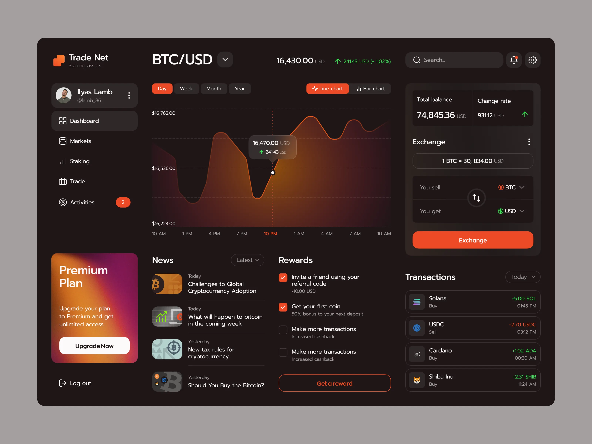

# 🎯 Sentiment Radar - AI 加密货币情绪雷达

一个展示加密货币市场情绪的现代化 Web 应用，使用 Next.js 15、TypeScript 和真实 API 数据构建。



## ✨ 核心特性

### 🎨 双主题模式
- **Dark Mode**: 橙红色主题，适合夜间浏览
- **Light Mode**: 清新绿色主题，白天更舒适
- 一键切换，自动保存偏好设置

### 📊 实时数据可视化
- **Fear & Greed Index**: 实时获取市场情绪指数
- **全球市场数据**: 总市值、24h交易量、BTC占比
- **Top Cryptocurrencies**: 主流加密货币实时行情
- **7天趋势图**: 每个币种的价格走势 Sparkline

### 📱 完美响应式设计
- 手机端（< 640px）：单列布局，紧凑显示
- 平板端（640px - 1024px）：双列网格
- 桌面端（> 1024px）：多列网格，最佳视觉体验

### 🔥 智能交互
- 侧边栏折叠/展开
- 时间范围切换（Week/Month/Year）
- 图表自适应缩放
- 平滑动画过渡

## 🚀 快速开始

### 安装依赖

```bash
npm install
```

### 启动开发服务器

```bash
npm run dev
```

访问 [http://localhost:3001](http://localhost:3001)

### 构建生产版本

```bash
npm run build
npm start
```

## 📁 项目结构

```
emotion/
├── app/
│   ├── layout.tsx                    # 根布局（ThemeProvider + Sidebar + Header）
│   ├── page.tsx                      # Dashboard 首页
│   ├── coin/[symbol]/page.tsx        # 币种详情页
│   ├── api/                          # API 路由
│   │   ├── fear-greed/route.ts       # Fear & Greed Index API
│   │   ├── ticker/route.ts           # 加密货币行情 API
│   │   └── global/route.ts           # 全局市场数据 API
│   ├── globals.css                   # 全局样式（含主题变量）
│   └── icon.svg                      # Favicon
├── components/
│   ├── ui/                           # shadcn UI 基础组件
│   ├── layout/                       # 布局组件
│   │   ├── sidebar.tsx               # 侧边导航栏（可折叠）
│   │   └── header.tsx                # 顶部导航栏（含主题切换）
│   ├── dashboard/                    # Dashboard 组件
│   │   ├── coin-card.tsx             # 币种卡片（含 sparkline）
│   │   ├── news-section.tsx          # 新闻列表
│   │   └── metric-card.tsx           # 指标卡片
│   ├── charts/                       # 图表组件
│   │   ├── sentiment-gauge.tsx       # 情绪仪表盘
│   │   ├── sentiment-area-chart.tsx  # 情绪趋势图（可切换时间范围）
│   │   └── sparkline.tsx             # 7天迷你趋势线（动态缩放）
│   ├── theme-provider.tsx            # 主题上下文管理
│   └── theme-toggle.tsx              # 主题切换按钮
├── lib/
│   ├── utils.ts                      # 工具函数
│   ├── api.ts                        # API 调用函数
│   └── mock-data.ts                  # Mock 数据（fallback）
└── types/
    └── index.ts                      # TypeScript 类型定义
```

## 🎨 设计系统

### Light Mode（绿色主题）
- **主色调**: `hsl(164 76% 46%)` - Teal Green
- **背景**: `hsl(0 0% 98%)` - 浅灰白
- **卡片**: `hsl(0 0% 100%)` - 纯白
- **文字**: `hsl(0 0% 10%)` - 深灰

### Dark Mode（橙红色主题）
- **主色调**: `hsl(14 100% 64%)` - 橙红色
- **背景**: `hsl(0 0% 10%)` - 深灰黑
- **卡片**: `hsl(0 0% 14%)` - 深色卡片
- **文字**: `hsl(0 0% 98%)` - 浅白

### 情绪配色（通用）
- **Fear（恐惧）**: `hsl(0 84% 60%)` - 红色
- **Neutral（中性）**: `hsl(43 96% 56%)` - 黄色
- **Greed（贪婪）**: 根据主题自适应（Light: Teal, Dark: Green）

## 📊 数据来源

### Alternative.me API
项目使用 [Alternative.me Crypto API](https://alternative.me/crypto/api/) 获取真实数据：

1. **Fear & Greed Index**
   - 端点: `https://api.alternative.me/fng/`
   - 数据: 加密货币市场情绪指数（0-100）
   - 更新频率: 实时

2. **Ticker（行情数据）**
   - 端点: `https://api.alternative.me/v2/ticker/`
   - 数据: Top 加密货币价格、涨跌幅、市值
   - 更新频率: 每5分钟

3. **Global Market**
   - 端点: `https://api.alternative.me/v2/global/`
   - 数据: 全球市场总览
   - 更新频率: 实时

### 数据处理
- 服务端渲染（SSR）：首屏数据由服务端获取
- 客户端更新：时间范围切换时动态获取
- 缓存策略：5分钟 revalidate
- 错误处理：API 失败时使用 Mock 数据兜底

## 🛠️ 技术栈

### 核心框架
- **Next.js 15**: React 框架，App Router
- **React 19**: 前端框架
- **TypeScript**: 类型安全

### UI & 样式
- **Tailwind CSS v3**: 原子化 CSS
- **shadcn/ui**: 高质量 React 组件
- **CVA**: 组件样式变体管理
- **Lucide React**: 图标库

### 数据可视化
- **Recharts**: 图表库
  - AreaChart: 情绪趋势面积图
  - LineChart: 7天 Sparkline
  - 自适应缩放，响应式设计

### 状态管理
- **React Context**: 主题管理
- **localStorage**: 主题偏好持久化

## 📦 核心依赖

```json
{
  "next": "^16.0.5",
  "react": "^19.2.0",
  "typescript": "^5.8.3",
  "tailwindcss": "^3.4.1",
  "recharts": "^3.5.0",
  "lucide-react": "^0.555.0",
  "class-variance-authority": "^0.7.1",
  "clsx": "^2.1.1",
  "tailwind-merge": "^2.7.0"
}
```

## 🔧 可用脚本

```bash
# 开发
npm run dev          # 启动开发服务器（Turbopack）
npm run build        # 构建生产版本
npm start            # 运行生产服务器

# 代码质量
npm run lint         # ESLint 代码检查
npm run type-check   # TypeScript 类型检查
```

## 📱 响应式断点

```css
/* 手机端 */
默认 (< 640px)

/* 平板端 */
sm: 640px

/* 桌面端 */
lg: 1024px

/* 大屏 */
xl: 1280px
```

## 🎯 功能清单

### ✅ 已完成
- [x] Dark/Light 主题切换
- [x] 响应式布局（手机/平板/PC）
- [x] 真实 API 数据接入
- [x] Fear & Greed Index 可视化
- [x] 全球市场数据展示
- [x] Top 加密货币行情
- [x] 7天价格走势 Sparkline
- [x] 时间范围切换（Week/Month/Year）
- [x] 动态图表缩放
- [x] Favicon 设置
- [x] 侧边栏折叠
- [x] 主题偏好持久化

### 🚧 计划中
- [ ] 用户自定义币种列表
- [ ] 价格提醒功能
- [ ] 更多图表类型（雷达图、K线图）
- [ ] 数据导出（CSV/JSON）
- [ ] 多语言支持（i18n）
- [ ] PWA 支持
- [ ] 实时 WebSocket 数据推送

## 🐛 已知问题

暂无

## 📝 开发日志

### v1.0.0 (2025-01-XX)
- ✨ 初始版本发布
- ✨ 实现 Dark/Light 主题切换
- ✨ 完成响应式设计
- ✨ 接入 Alternative.me API
- ✨ 优化图表显示

## 🤝 贡献指南

欢迎提交 Issue 和 Pull Request！

## 📄 License

MIT

---

**Made with ❤️ using Next.js & Alternative.me API**
